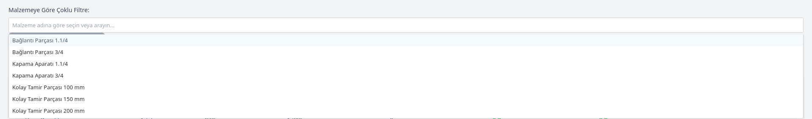

# Stok Takibi

Mal alım işleri ile ilgilenen kişilerin, ambar stok durumunu takip etmek ve raporlamak için kullanılabileceği web uygulaması.

ChatGPT ve Gemini'a, talep ve isteklerimi anlatarak, web tabanlı stok takip edebileceğimiz ve rapor hazırlayabileceğimiz güzel ve işlevsel bir proje üretiyoruz.

## Web uygulamasının Özellikleri;

* CSV uzantılı dosyadan veri yüklenebilir.

* Malzeme Adına göre arama yapılabilir.

* Arama Çubuğu bir buton aracılığı ile temizlenebilir.

* Stok Durumuna (Stok Yeterli, Stok azalıyor, Stok Kritik) göre filtreleme yapılabilir.

* Sayfa başına gösterilecek malzeme (tablo satır sayısı) ayarlanabilmeli.

* Rapor PDF olarak dışa aktarılabilir.

* Stok durumuna ya da sayfa başına gösterilen malzeme listesine göre rapor PDF olarak dışa aktarılabilir.

* Kritik Malzemelerden 5'i, çubuk grafik olarak gösterilmeli ve veri etiketi olmalı.

* Tablodaki renklerin ne anlama geldiğini gösteren lejant olmalı.

* Malzeme Tablosu, başlıklarına göre sıralanabilmeli.   

## Uygulama Görüntüleri

### Grafikler

* Ham verimizi barındıran **CSV** dosyasını seçip **Yükle** butonuna basıldığında, başlığın altındaki bölüme **güncel tarih ve saat bilgisi** ekleniyor. İstenirse bu bilgi değiştirilebilir.

* Grafik başlıklarına tıklayarak grafikler **gizlenebilir**. Bu durumda sayfa **PDF** olarak dışa aktarıldığında, gizlenen grafikler raporda gösterilmez.

### Genel Stok ve Maliyet Özeti

* **Genel Stok ve Maliyet Özeti** bilgi kartları, malzeme birimlerine göre (adet, metre, ...vb)  ayrı bir bölümde görüntüleniyor. Bu bölüm de istenirse gizlenebilir.

### Rapor Ayarları

* Kritik eşik ve Uyarı eşiği ayarları (Stok Durumu: Stok Yeterli, Stok azalıyor, Stok Kritik) değiştirilebilir. Bununla birlikte tablo renklendirilmesine müdahale edilmiş oluyor.

* Tablodaki Malzemelerin Mevcut stok durumuna göre mi? İhale sonrası Stok durumuna göre mi renklendirilebileceği seçilebiliyor.

* Kategoriye göre filtreleme yapılabilir.

* Sütunlar gizlenip / gösterilebilir. 

* Tablo başlıklarında bulunan hemen tüm miktar ve parasal değerlere ait geniş kapsamlı filtreleme yapılabilir.

* Malzemeye göre çoklu filtreleme yapılabilir. Arama çubuğuna tıklandığında mevcut malzeme listesi açılır, çoklu seçim yapılarak filtre uygulanabilir. 

* Arama yapmak için yazmaya başlanıldığında mevcut malzeme listesinde eşleşen seçenekler görüntülenir. Sadece seçilen malzemelere ait rapor görüntülenir.

### Sıralama Özelliği

* Tablo başlıklarına (Malzme Kategorisi, Malzme Adı,  Birim Fiyat, Stok Miktarı, ...vb) tıklanarak tüm tablo bilgisi, tıklanan başlık bilgisinin **A'dan Z'ye** ya da **Büyükten Küçüğe sıralamak*** mümkün.
  
  Tüm **Kategori** ve **Sütun bilgileri** görünür (açık) olarak ayarlanmışken **Malzame Adına göre Sıralama** yapılmış halde bir rapor görseli aşağıda görülmektedir.
  
   

### PDF Olarak Dışa Aktar

* Sayfa başında bulunan **PDF Olarak Dışa Aktar** butonu yardımı ile, hazırlanan rapor Önce yazdırma önizleme ekranı ile karşınıza sunulur ve isteğiniz doğrultusunda PDF'e dönüştürülür.
  
  
